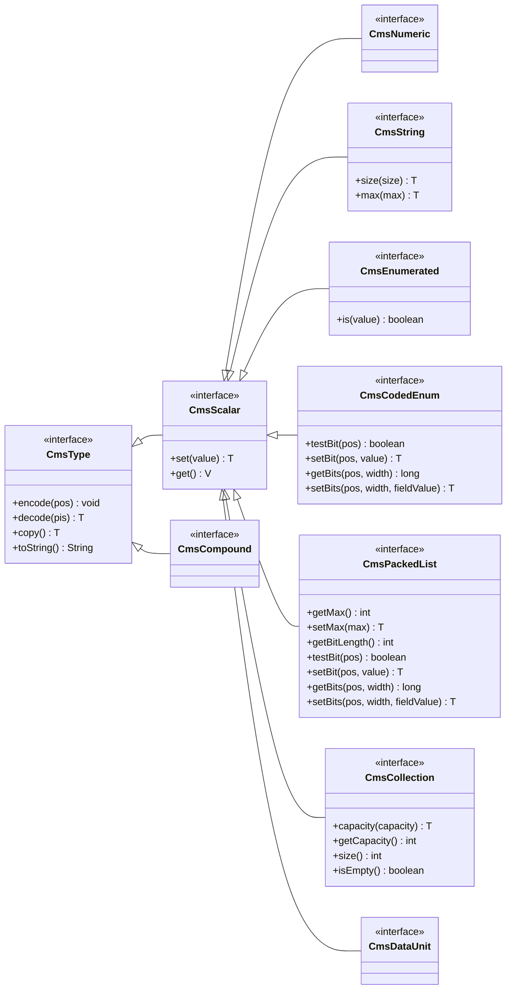
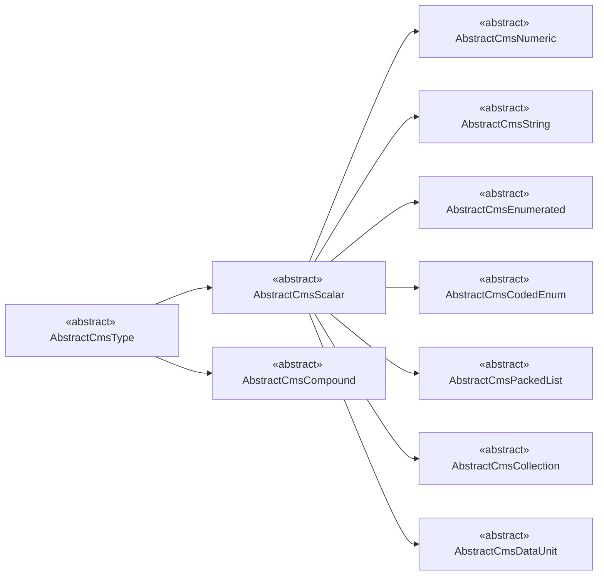

# 第七章 数据类型实现

## 概述

## 类型系统基础

包名：`com.ysh.dlt2811bean.datatypes.type`

### 接口层次

### 抽象类层次

## 数值类型

包名：`com.ysh.dlt2811bean.datatypes.numeric`

### 数值类型介绍

### 数值类的实现

| 类名 | 中文名 | 章节 | 最小值 | 最大值 |
|------|--------|------|--------|--------|
| `AbstractCmsNumeric` | - | - | - | - |
| `CmsBoolean` | 布尔型 | §7.1.1 | `false` | `true` |
| `CmsInt8` | 有符号整型 | §7.1.2 | \(-2^{7}\) | \(2^{7}-1\) |
| `CmsInt16` | 有符号整型 | §7.1.2 | \(-2^{15}\) | \(2^{15}-1\) |
| `CmsInt32` | 有符号整型 | §7.1.2 | \(-2^{31}\) | \(2^{31}-1\) |
| `CmsInt64` | 有符号整型 | §7.1.2 | \(-2^{63}\) | \(2^{63}-1\) |
| `CmsInt8U` | 无符号整型 | §7.1.3 | \(0\) | \(2^{8}-1\) |
| `CmsInt16U` | 无符号整型 | §7.1.3 | \(0\) | \(2^{16}-1\) |
| `CmsInt24U` | 无符号整型 | §7.1.3 | \(0\) | \(2^{24}-1\) |
| `CmsInt32U` | 无符号整型 | §7.1.3 | \(0\) | \(2^{32}-1\) |
| `CmsInt64U` | 无符号整型 | §7.1.3 | \(0\) | \(2^{64}-1\) |
| `CmsFloat32` | 浮点型 | §7.1.4 | IEEE 754 binary32 | IEEE 754 binary32 |
| `CmsFloat64` | 浮点型 | §7.1.4 | IEEE 754 binary64 | IEEE 754 binary64 |

## 字符串类型

包名：`com.ysh.dlt2811bean.datatypes.string`

### 字符串类型介绍

### 字符串类的实现

| 类名 | 中文名 | 章节 |
|------|--------|------|
| `AbstractCmsString` | 数据串 | §7.1.5 |
| `CmsVisibleString` | 可视字符串型 | §7.1.5 |
| `CmsUtf8String` | Unicode字符串型 | §7.1.5 |
| `CmsOctetString` | 八位组串型 | §7.1.5 |
| `CmsBitString` | 位串型 | §7.1.5 |
| `CmsObjectName` | 对象名 | §7.3.1 |
| `CmsObjectReference` | 对象引用 | §7.3.2 |
| `CmsSubReference` | 子引用 | §7.3.3 |
| `CmsEntryID` | 条目标识 | §7.3.8 |
| `CmsFC` | 功能约束 | §7.4 |

## 枚举类型

包名：`com.ysh.dlt2811bean.datatypes.enumerated`

### 枚举类型介绍

### 枚举类的实现

| 类名 | 中文名 | 章节 |
|------|--------|------|
| `AbstractCmsEnumerated` | 枚举 | §7.1.6 |
| `CmsDbpos` | 双点位置 | §7.3.5 |
| `CmsTcmd` | 档位命令 | §7.3.7 |
| `CmsServiceError` | 服务错误 | §7.3.11 |
| `CmsOrCat` | 发出者类别 | §7.5.2 |
| `CmsAddCause` | 控制操作的附加原因 | §7.5.4 |
| `CmsSmpMod` | 采样模式 | §7.6.7 |

## 位域编码类型

包名：`com.ysh.dlt2811bean.datatypes.code`

### 位域编码类型介绍

### 位域编码类的实现

| 类名 | 中文名 | 章节 |
|------|--------|------|
| `AbstractCmsCodedEnum` | 编码枚举 | §7.1.7 |
| `CmsTimeQuality` | 时标品质 | §7.3.4 |
| `CmsQuality` | 品质 | §7.3.6 |
| `CmsCheck` | 控制操作的检测 | §7.5.3 |
| `CmsTriggerConditions` | 触发条件 | §7.6.2 |
| `CmsReasonCode` | 触发原因 | §7.6.3 |
| `CmsRcbOptFlds` | 报告控制块的选项域 | §7.6.4 |
| `CmsLcbOptFlds` | 日志控制块的选项域 | §7.6.5 |
| `CmsMsvcbOptFlds` | 多播采样值控制块的选项域 | §7.6.6 |

## 压缩列表类型

包名：`com.ysh.dlt2811bean.datatypes.packed`

### 压缩列表类型介绍

### 压缩列表类的实现

| 类名 | 中文名 | 章节 |
|------|--------|------|
| `AbstractCmsPackedList` | 压缩列表 | §7.1.8 |
| `CmsPackedListImpl` |  | §7.1.8 |

## 复合类型

包名：`com.ysh.dlt2811bean.datatypes.compound`

### 复合类型介绍

### 复合类的实现

| 类名 | 中文名 | 章节 |
|------|--------|------|
| `AbstractCmsCompound` | - | - |
| `CmsUtcTime` | 协调世界时 | §7.2.1 |
| `CmsBinaryTime` | 二进制时间 | §7.2.2 |
| `CmsTimeStamp` | 时标(协调世界时) | §7.3.4 |
| `CmsEntryTime` | 条目时间(二进制时间) | §7.3.9 |
| `CmsFileEntry` | 文件条目 | §7.3.10 |
| `CmsPhyComAddr` | 物理通信地址 | §7.3.12 |
| `CmsOriginator` | 控制操作的发出者 | §7.5.2 |

## 集合类型

包名：`com.ysh.dlt2811bean.datatypes.collection`

### 集合类型介绍

### 集合类的实现

| 类名 | 中文名 | 章节 |
|------|--------|------|
| `AbstractCmsCollection` | - | - |
| `CmsArray` | - | §7.7.1 |
| `CmsStructure` | - | §7.7.1 |

## 数据类型

包名：`com.ysh.dlt2811bean.datatypes.data`

### 数据类型介绍

### 数据类的实现

| 类名 | 中文名 | 章节 |
|------|--------|------|
| `AbstractCmsDataUnit` | - | - |
| `CmsData` | 数据值 | §7.7.1 |
| `CmsDataDefinition` |  | §7.7.2 |
