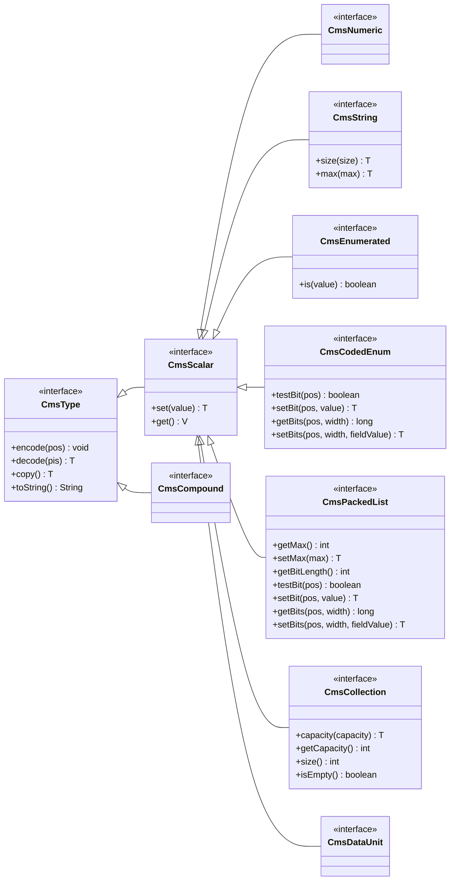
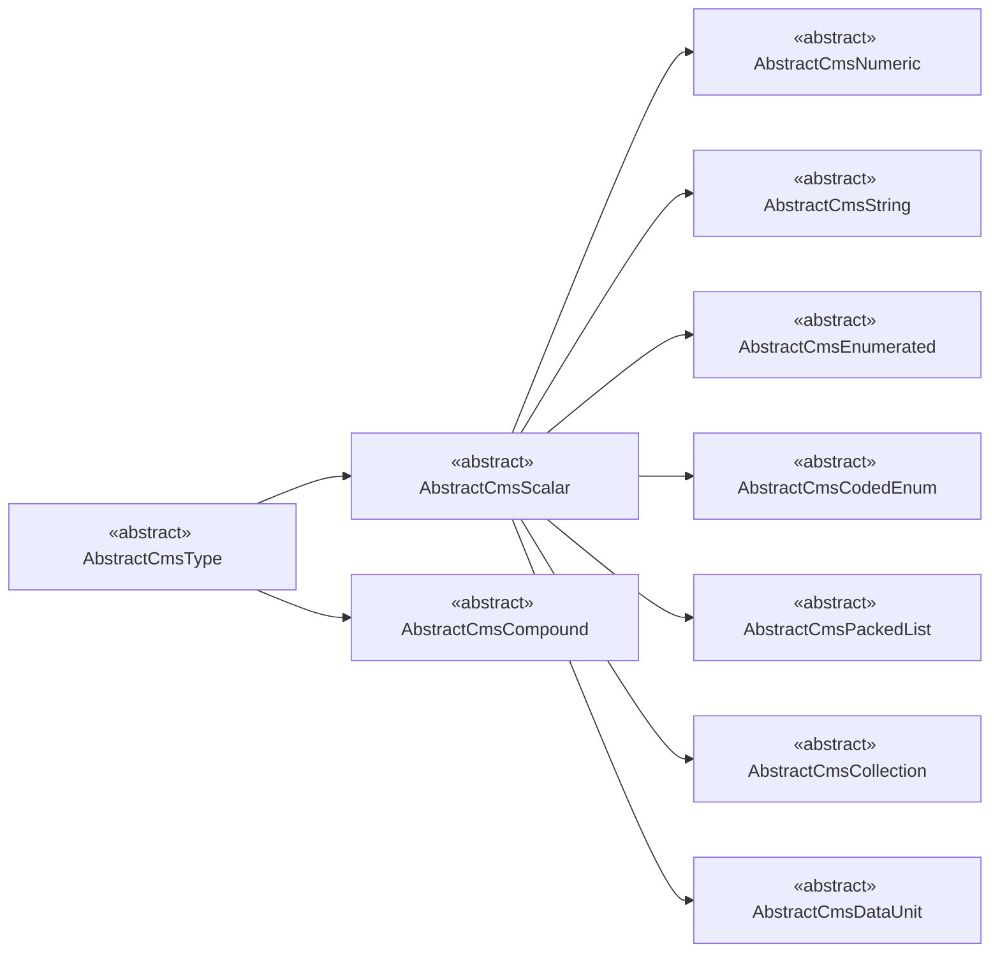

# 第七章 数据类型实现

## 概述

`datatypes` 模块实现了 DL/T 2811 协议第七章定义的所有数据类型，包括数值、字符串、枚举、位域编码、压缩列表、复合类型、集合类型以及 Data/DataDefinition 等 24 种 CHOICE 分支。模块采用分层接口设计，以 `CmsType` 为根接口，向下派生出 `CmsScalar`（标量）、`CmsCompound`（复合）等子接口，并通过 `AbstractCmsType` → `AbstractCmsScalar` → 具体抽象类的继承链，为每种类型族提供统一的 encode/decode 能力。所有类型均基于 PER 编码规则，可直接与协议二进制流互转。

## 类型系统基础

包名：`com.ysh.dlt2811bean.datatypes.type`

### 接口层次



### 抽象类层次



## 数值类型

包名：`com.ysh.dlt2811bean.datatypes.numeric`

### 数值类型介绍

数值类型实现了 DL/T 2811 协议 §7.1.1\~§7.1.4 定义的布尔型、有符号/无符号整型和浮点型。所有数值类继承自 `AbstractCmsNumeric`，底层委托 PER 编码器（`PerBoolean`、`PerInteger`、`PerFloat32`/`PerFloat64`）完成二进制编解码。整型支持 8/16/32/64 位有符号和无符号共 8 种变体，其中 `CmsInt24U` 为协议特有的 24 位无符号整型；浮点型严格遵循 IEEE 754 单精度/双精度格式。

### 使用案例

```java
// 创建并编码
PerOutputStream pos = new PerOutputStream();
CmsBoolean.write(pos, true);
CmsInt8.write(pos, -128);
CmsInt16.write(pos, 32767);
CmsInt32.write(pos, -2147483648);
CmsInt64.write(pos, 9223372036854775807L);
CmsInt8U.write(pos, 255);
CmsInt16U.write(pos, 65535);
CmsInt24U.write(pos, 16777215);
CmsInt32U.write(pos, 4294967295L);
CmsInt64U.write(pos, new BigInteger("18446744073709551615"));
CmsFloat32.write(pos, 3.14f);
CmsFloat64.write(pos, 3.141592653589793);
byte[] encoded = pos.toByteArray();
```

```java
// 解码
PerInputStream pis = new PerInputStream(encoded);
boolean v1 = CmsBoolean.read(pis).get();
int v2 = CmsInt8.read(pis).get();
int v3 = CmsInt16.read(pis).get();
int v4 = CmsInt32.read(pis).get();
long v5 = CmsInt64.read(pis).get();
int v6 = CmsInt8U.read(pis).get();
int v7 = CmsInt16U.read(pis).get();
int v8 = CmsInt24U.read(pis).get();
long v9 = CmsInt32U.read(pis).get();
BigInteger v10 = CmsInt64U.read(pis).get();
float v11 = CmsFloat32.read(pis).get();
double v12 = CmsFloat64.read(pis).get();
```

### 数值类的实现

| 类名                   | 中文名   | 章节     | 最小值               | 最大值               |
| -------------------- | ----- | ------ | ----------------- | ----------------- |
| `AbstractCmsNumeric` | -     | -      | -                 | -                 |
| `CmsBoolean`         | 布尔型   | §7.1.1 | `false`           | `true`            |
| `CmsInt8`            | 有符号整型 | §7.1.2 | (-2^{7})          | (2^{7}-1)         |
| `CmsInt16`           | 有符号整型 | §7.1.2 | (-2^{15})         | (2^{15}-1)        |
| `CmsInt32`           | 有符号整型 | §7.1.2 | (-2^{31})         | (2^{31}-1)        |
| `CmsInt64`           | 有符号整型 | §7.1.2 | (-2^{63})         | (2^{63}-1)        |
| `CmsInt8U`           | 无符号整型 | §7.1.3 | (0)               | (2^{8}-1)         |
| `CmsInt16U`          | 无符号整型 | §7.1.3 | (0)               | (2^{16}-1)        |
| `CmsInt24U`          | 无符号整型 | §7.1.3 | (0)               | (2^{24}-1)        |
| `CmsInt32U`          | 无符号整型 | §7.1.3 | (0)               | (2^{32}-1)        |
| `CmsInt64U`          | 无符号整型 | §7.1.3 | (0)               | (2^{64}-1)        |
| `CmsFloat32`         | 浮点型   | §7.1.4 | IEEE 754 binary32 | IEEE 754 binary32 |
| `CmsFloat64`         | 浮点型   | §7.1.4 | IEEE 754 binary64 | IEEE 754 binary64 |

## 字符串类型

包名：`com.ysh.dlt2811bean.datatypes.string`

### 字符串类型介绍

字符串类型实现了 DL/T 2811 协议 §7.1.5 定义的可视字符串、UTF-8 字符串、八位组串和位串，以及 §7.3 中的对象名、对象引用、子引用、功能约束等协议专用字符串类型。所有字符串类继承自 `AbstractCmsString`，底层委托 `PerOctetString` 或 `PerVisibleString` 等 PER 编码器完成编解码。字符串长度通过 `size()`/`max()` 方法约束，支持定长和变长两种模式。

### 使用案例

```java
// 创建并编码
PerOutputStream pos = new PerOutputStream();
CmsVisibleString.write(pos, "hello", Mode.VARIABLE, 255);
CmsUtf8String.write(pos, "你好", Mode.VARIABLE, 255);
CmsOctetString.write(pos, new byte[]{0x01, 0x02, 0x03}, Mode.VARIABLE, 64);
CmsBitString.write(pos, new byte[]{(byte) 0xAB}, 8, Mode.VARIABLE, 16);
CmsObjectName.write(pos, "LD1");
CmsObjectReference.write(pos, "LD1/LN1.DO1");
CmsSubReference.write(pos, "LN.DO.DA");
CmsFC.write(pos, "ST");
CmsEntryID.write(pos, new byte[8]);

// CmsFC 还提供了校验方法
boolean valid = CmsFC.isValid("ST");  // true
boolean invalid = CmsFC.isValid("GG"); // false

byte[] encoded = pos.toByteArray();
```

```java
// 解码
PerInputStream pis = new PerInputStream(encoded);
String v1 = CmsVisibleString.read(pis, Mode.VARIABLE, 255).get();
String v2 = CmsUtf8String.read(pis, Mode.VARIABLE, 255).get();
byte[] v3 = CmsOctetString.read(pis, Mode.VARIABLE, 64).get();
byte[] v4 = CmsBitString.read(pis, Mode.VARIABLE, 16).get();
String v5 = CmsObjectName.read(pis).get();
String v6 = CmsObjectReference.read(pis).get();
String v7 = CmsSubReference.read(pis).get();
String v8 = CmsFC.read(pis).get();
byte[] v9 = CmsEntryID.read(pis).get();
```

### 字符串类的实现

| 类名                   | 中文名         | 章节     |
| -------------------- | ----------- | ------ |
| `AbstractCmsString`  | 数据串         | §7.1.5 |
| `CmsVisibleString`   | 可视字符串型      | §7.1.5 |
| `CmsUtf8String`      | Unicode字符串型 | §7.1.5 |
| `CmsOctetString`     | 八位组串型       | §7.1.5 |
| `CmsBitString`       | 位串型         | §7.1.5 |
| `CmsObjectName`      | 对象名         | §7.3.1 |
| `CmsObjectReference` | 对象引用        | §7.3.2 |
| `CmsSubReference`    | 子引用         | §7.3.3 |
| `CmsEntryID`         | 条目标识        | §7.3.8 |
| `CmsFC`              | 功能约束        | §7.4   |

## 枚举类型

包名：`com.ysh.dlt2811bean.datatypes.enumerated`

### 枚举类型介绍

枚举类型实现了 DL/T 2811 协议 §7.1.6 定义的枚举编码，以及 §7.3/§7.5/§7.6 中的双点位置、档位命令、服务错误、发出者类别、控制附加原因、采样模式等协议枚举值。所有枚举类继承自 `AbstractCmsEnumerated`，底层委托 `PerEnumerated` 编码器，通过最大索引值自动计算所需比特位宽。

### 枚举类的实现

| 类名                      | 中文名       | 章节      |
| ----------------------- | --------- | ------- |
| `AbstractCmsEnumerated` | 枚举        | §7.1.6  |
| `CmsServiceError`       | 服务错误      | §7.3.11 |
| `CmsOrCat`              | 发出者类别     | §7.5.2  |
| `CmsAddCause`           | 控制操作的附加原因 | §7.5.4  |
| `CmsSmpMod`             | 采样模式      | §7.6.7  |

### 使用案例

```java
// 创建并编码
PerOutputStream pos = new PerOutputStream();
CmsServiceError.write(pos, CmsServiceError.INSTANCE_NOT_AVAILABLE);
CmsOrCat.write(pos, CmsOrCat.BAY_CONTROL);
CmsAddCause.write(pos, CmsAddCause.REMOTE_COMMAND);
CmsSmpMod.write(pos, CmsSmpMod.SMP_PER_PERIOD);
byte[] encoded = pos.toByteArray();
```

```java
// 解码
PerInputStream pis = new PerInputStream(encoded);
int v1 = CmsServiceError.read(pis).get();
int v2 = CmsOrCat.read(pis).get();
int v3 = CmsAddCause.read(pis).get();
int v4 = CmsSmpMod.read(pis).get();
```

## 位域编码类型

包名：`com.ysh.dlt2811bean.datatypes.code`

### 位域编码类型介绍

位域编码类型实现了 DL/T 2811 协议 §7.1.7 定义的编码枚举，将多个布尔标志或小整型字段紧凑编码到一个整型值中。所有位域类继承自 `AbstractCmsCodedEnum`，底层委托 `PerCodedEnum` 编码器，支持按位读写（`testBit`/`setBit`）和按段读写（`getBits`/`setBits`）。典型应用包括品质（`CmsQuality`）、时标品质（`CmsTimeQuality`）、双点位置（`CmsDbpos`）、档位命令（`CmsTcmd`）、检测（`CmsCheck`）以及报告/日志/采样值控制块的选项域和触发条件等。

### 位域编码类的实现

| 类名                     | 中文名          | 章节     |
| ---------------------- | ------------ | ------ |
| `AbstractCmsCodedEnum` | 编码枚举         | §7.1.7 |
| `CmsTimeQuality`       | 时标品质         | §7.3.4 |
| `CmsDbpos`             | 双点位置         | §7.3.5 |
| `CmsQuality`           | 品质            | §7.3.6 |
| `CmsTcmd`              | 档位命令         | §7.3.7 |
| `CmsCheck`             | 控制操作的检测      | §7.5.3 |
| `CmsTriggerConditions` | 触发条件         | §7.6.2 |
| `CmsReasonCode`        | 触发原因         | §7.6.3 |
| `CmsRcbOptFlds`        | 报告控制块的选项域    | §7.6.4 |
| `CmsLcbOptFlds`        | 日志控制块的选项域    | §7.6.5 |
| `CmsMsvcbOptFlds`      | 多播采样值控制块的选项域 | §7.6.6 |

### 使用案例

```java
// 创建并编码（位域类型通常先 new 出来逐位设置，再 encode）
PerOutputStream pos = new PerOutputStream();

CmsDbpos dbpos = new CmsDbpos(CmsDbpos.ON);
dbpos.encode(pos);

CmsTcmd tcmd = new CmsTcmd(CmsTcmd.HIGH);
tcmd.encode(pos);

CmsQuality quality = new CmsQuality()
    .setValidity(CmsQuality.GOOD)
    .setBit(CmsQuality.OVERFLOW, false)
    .setBit(CmsQuality.TEST, true);
quality.encode(pos);

CmsCheck check = new CmsCheck()
    .setBit(CmsCheck.INTERLOCK_CHECK, true)
    .setBit(CmsCheck.SYNCHROCHECK, true);
check.encode(pos);

CmsTriggerConditions trigger = new CmsTriggerConditions()
    .setBit(CmsTriggerConditions.DATA_CHANGE, true)
    .setBit(CmsTriggerConditions.QUALITY_CHANGE, true);
trigger.encode(pos);

CmsRcbOptFlds optFlds = new CmsRcbOptFlds()
    .setBit(CmsRcbOptFlds.RESERVED, true)
    .setBit(CmsRcbOptFlds.TIME_STAMP, true);
optFlds.encode(pos);

byte[] encoded = pos.toByteArray();
```

```java
// 解码
PerInputStream pis = new PerInputStream(encoded);
CmsDbpos v1 = new CmsDbpos().decode(pis);
CmsTcmd v2 = new CmsTcmd().decode(pis);
CmsQuality v3 = new CmsQuality().decode(pis);
CmsCheck v4 = new CmsCheck().decode(pis);
CmsTriggerConditions v5 = new CmsTriggerConditions().decode(pis);
CmsRcbOptFlds v6 = new CmsRcbOptFlds().decode(pis);

// 解码后检查位
long dbposVal = v1.get();
long tcmdVal = v2.get();
boolean test = v3.testBit(CmsQuality.TEST);
boolean interlock = v4.testBit(CmsCheck.INTERLOCK_CHECK);
int validity = v3.getValidity();
```

## 压缩列表类型

包名：`com.ysh.dlt2811bean.datatypes.packed`

### 压缩列表类型介绍

压缩列表类型实现了 DL/T 2811 协议 §7.1.8 定义的紧凑位编码方式，将一组长度各异的位字段按序拼接为一个整体。所有压缩列表类继承自 `AbstractCmsPackedList`，底层委托 `PerPackedList` 编码器，通过 `getMax()` 定义总位宽，支持按位和按段读写。当前实现为 `CmsPackedListImpl`，适用于协议中需要极紧凑编码的场景。

### 压缩列表类的实现

| 类名                      | 中文名  | 章节     |
| ----------------------- | ---- | ------ |
| `AbstractCmsPackedList` | 压缩列表 | §7.1.8 |
| `CmsPackedListImpl`     | -    | §7.1.8 |

## 复合类型

包名：`com.ysh.dlt2811bean.datatypes.compound`

### 复合类型介绍

复合类型实现了 DL/T 2811 协议中由多个字段组合而成的结构化数据类型，包括 §7.2 的时间类型（`CmsUtcTime`、`CmsBinaryTime`）、§7.3 的时标/条目时间/文件条目/物理通信地址以及 §7.5 的发出者。所有复合类继承自 `AbstractCmsCompound`，通过 `registerField` 注册子字段，由框架自动遍历完成 encode/decode，无需手动编写编解码逻辑。

### 复合类的实现

| 类名                    | 中文名         | 章节      |
| --------------------- | ----------- | ------- |
| `AbstractCmsCompound` | -           | -       |
| `CmsUtcTime`          | 协调世界时       | §7.2.1  |
| `CmsBinaryTime`       | 二进制时间       | §7.2.2  |
| `CmsTimeStamp`        | 时标(协调世界时)   | §7.3.4  |
| `CmsEntryTime`        | 条目时间(二进制时间) | §7.3.9  |
| `CmsFileEntry`        | 文件条目        | §7.3.10 |
| `CmsPhyComAddr`       | 物理通信地址      | §7.3.12 |
| `CmsOriginator`       | 控制操作的发出者    | §7.5.2  |

### 使用案例

```java
// 创建并编码（复合类型先 new 出来设置各字段，再 encode）
PerOutputStream pos = new PerOutputStream();

CmsUtcTime utcTime = new CmsUtcTime()
    .secondsSinceEpoch(new CmsInt32U(1715000000L))
    .fractionOfSecond(new CmsInt24U(1234567))
    .timeQuality(new CmsTimeQuality(0x20));
utcTime.encode(pos);

CmsBinaryTime binaryTime = new CmsBinaryTime()
    .msOfDay(new CmsInt32U(43200000L))
    .daysSince1984(new CmsInt16U(15000));
binaryTime.encode(pos);

CmsOriginator originator = new CmsOriginator()
    .orCat(new CmsOrCat(CmsOrCat.BAY_CONTROL))
    .orIdent(new CmsOctetString(new byte[]{0x01, 0x02}).max(64));
originator.encode(pos);

CmsPhyComAddr phyAddr = new CmsPhyComAddr()
    .addr(new CmsOctetString().size(6).set(new byte[]{0x00, 0x01, 0x02, 0x03, 0x04, 0x05}))
    .priority(new CmsInt8U().set(4))
    .vid(new CmsInt16U().set(100))
    .appid(new CmsInt16U().set(0x0001));
phyAddr.encode(pos);

CmsFileEntry fileEntry = new CmsFileEntry()
    .fileName(new CmsVisibleString("report.txt").max(129))
    .fileSize(new CmsInt32U(1024))
    .lastModified(utcTime)
    .checkSum(new CmsInt32U(0xAABBCCDDL));
fileEntry.encode(pos);

byte[] encoded = pos.toByteArray();
```

```java
// 解码
PerInputStream pis = new PerInputStream(encoded);
CmsUtcTime v1 = new CmsUtcTime().decode(pis);
CmsBinaryTime v2 = new CmsBinaryTime().decode(pis);
CmsOriginator v3 = new CmsOriginator().decode(pis);
CmsPhyComAddr v4 = new CmsPhyComAddr().decode(pis);
CmsFileEntry v5 = new CmsFileEntry().decode(pis);

// 解码后访问字段
long seconds = v1.secondsSinceEpoch.get();
long msOfDay = v2.msOfDay.get();
int orCat = v3.orCat.get();
byte[] addr = v4.addr.get();
long fileSize = v5.fileSize.get();
```

## 集合类型

包名：`com.ysh.dlt2811bean.datatypes.collection`

### 集合类型介绍

集合类型实现了 DL/T 2811 协议 §7.7.1 中 Data 类型内部使用的两种容器结构：`CmsArray`（SEQUENCE OF，有序列表）和 `CmsStructure`（SEQUENCE，具名字段集合）。所有集合类继承自 `AbstractCmsCollection`，底层委托 PER 编码器完成长度和元素的编解码。`CmsArray` 支持通过 `max()` 约束最大元素数，`CmsStructure` 通过 `registerField` 注册子字段实现自动编解码。

### 集合类的实现

| 类名                      | 中文名 | 章节     |
| ----------------------- | --- | ------ |
| `AbstractCmsCollection` | -   | -      |
| `CmsArray`              | -   | §7.7.1 |
| `CmsStructure`          | -   | §7.7.1 |

## 数据类型

包名：`com.ysh.dlt2811bean.datatypes.data`

### 数据类型介绍

数据类型实现了 DL/T 2811 协议 §7.7 定义的 Data 和 DataDefinition 两种顶层 CHOICE 类型。`CmsData` 承载实际数据值，内部持有 24 种分支之一的实例，encode/decode 时先编码 CHOICE 索引再委托给具体值；`CmsDataDefinition` 描述数据的类型结构，基本类型仅编码索引（NULL），字符串类型附加长度约束，数组和结构类型递归描述子元素类型。两者共享同一套 CHOICE 索引常量。


### 使用案例

```java
// 创建并编码
PerOutputStream pos = new PerOutputStream();

// CmsArray — 同构数组，所有元素类型相同
CmsArray<CmsInt32> array = new CmsArray<>(CmsInt32.class).max(10);
array.add(new CmsInt32(100)).add(new CmsInt32(200)).add(new CmsInt32(300));
CmsData.write(pos, array);

// CmsStructure — 异构结构体，元素类型可以不同
CmsStructure structure = new CmsStructure().capacity(10)
    .add(new CmsInt32(42))
    .add(new CmsVisibleString("hello").max(10))
    .add(new CmsFloat64(3.14));
CmsData.write(pos, structure);

byte[] encoded = pos.toByteArray();
```

```java
// 解码
PerInputStream pis = new PerInputStream(encoded);

// 解码 CmsArray（需提供模板）
CmsArray<CmsInt32> arrayTemplate = new CmsArray<>(CmsInt32.class).max(10);
CmsData.read(pis, arrayTemplate);
int first = arrayTemplate.get(0).get();   // 100
int second = arrayTemplate.get(1).get();  // 200

// 解码 CmsStructure（需提供模板）
CmsStructure structTemplate = new CmsStructure().capacity(10)
    .add(new CmsInt32())
    .add(new CmsVisibleString("").max(10))
    .add(new CmsFloat64(0.0));
CmsData.read(pis, structTemplate);
int intVal = ((CmsData<CmsInt32>) structTemplate.get(0)).get();           // 42
String strVal = ((CmsData<CmsVisibleString>) structTemplate.get(1)).get(); // "hello"
```

### 数据类的实现

| 类名                    | 中文名  | 章节     |
| --------------------- | ---- | ------ |
| `AbstractCmsDataUnit` | -    | -      |
| `CmsData`             | 数据值  | §7.7.1 |
| `CmsDataDefinition`   | 数据定义 | §7.7.2 |

